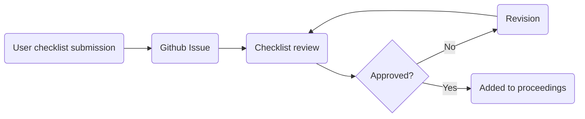

# Coding Standards Certification
[](https://doi.org/10.5281/zenodo.7693084)

This repo contains [checklists](https://www.nmind.org/standards-checklist) for bronze, silver, and gold tiers of NMIND standards.

These checklists are encoded in JSON in [`checklists/checklist.json`](checklists/checklist.json) and rendered human-readable at [nmind.org/standards-checklist](https://www.nmind.org/standards-checklist).

## Benefits

### Bronze Tier
- Being able to cite the software in grant applications and publications! (DOI)
- Reasonable degree of certainty other will be able to install and use your code!

### Silver Tier
- All benefits of bronze plus...
- Accessibility across a range of user experience.
- Greater portability of code (with containers) makes it more available to users, increasing the likelihood of your tool being used.
- Greater stability during development due to tests constantly checking code.

### Gold Tier
- All benefits of silver plus...
- A greater sense of community guidelines, attracting contributors.
- Extensive documentation assists users with more advanced use cases.
- JoSS will increase the visibility of your project!

## The checklist format

The file `checklists/checklist.json` contains the description
of the bronze, silver and gold tier checklists, which
are rendered by the application in `interactive/`.

For example, this snippet:

```json
    {
      "id": "bronze_doc_1",
      "prompt": "Landing page (e.g., GitHub README, website) provides a link to documentation and brief description of what program does",
      "tier": "bronze",
      "section": "documentation",
      "type": "checkbox"
    },
```

renders under the **Bronze** heading as the checklist item:

> * [ ] Landing page (e.g., GitHub README, website) provides a link to documentation and brief description of what program does

## Workflow

The workflow to add a new tool to the proceedings page is as follows:



1. User submits checklist from the [web app](https://nmind.org/standards-checklist)
2. An issue is created from submitted checklist
3. Review process with NMIND moderator via created issue
4. When approved (addition of `approved` label), user submission is added to the [checklist](https://nmind.org/proceedings) via CI.


---

Inspired by the [original hackmd document](https://hackmd.io/@mathiasg/SJCPHKZKu).
